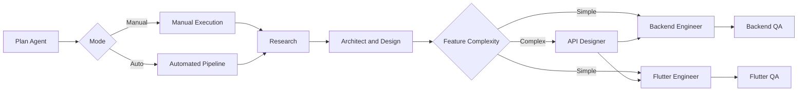

# Agentic SDLC for Claude Code


**Streamlined, efficient feature workflow** with dual-mode operation. Every feature is a self-contained unit under `.agents/<feature>/`.
Agents resolve repo locations/descriptions **only** from `.agents/config.json`.



## Install

Copy **once** into any workspace (skips if targets already exist; never overwrites). From your workspace, clone the repository and run:

**macOS / Linux**

```bash
./agents/install.sh
```

**Windows / WSL (PowerShell)**

```powershell
pwsh -File .\agents\install.ps1
```

What it does:

* Copies this repo’s **`.agents/` → `<workspace>/.agents/`**
* Copies this repo’s **`agents/` → `<workspace>/.claude/agents/`**

**Manual install (alternative)**
Copy `.agents/` to your workspace root, and `agents/` to `<workspace>/.claude/agents/`.

## Configure repos (`.agents/config.json`)

Agents read repo roots/descriptions here for direct application of changes.

```json
{
  "repos": [
    {
      "key": "backend",
      "path": "../backend",
      "type": "backend",
      "description": "Firebase Functions, Firestore Rules, indexes, emulators."
    },
    {
      "key": "frontend",
      "path": "../frontend",
      "type": "app",
      "description": "Flutter app: screens, routing (GoRouter), blocs, repos, tests."
    }
  ]
}
```

## Getting Started

> [!TIP]
> **Manual Mode**: `start: <feature> [links]` - Creates structure for manual agent execution
>
> **Automated Mode**: `start: <feature> --auto [links]` - Runs complete pipeline automatically

## Feature layout

```
.agents/<feature>/
  brief.md
  plan.md                # created/maintained by plan agent
  status.json            # real-time stage status
  workflow.md            # automated pipeline decisions (auto mode)
  ui/                    # Figma links/exports (optional)
  research/              # streamlined: current-state, options, recommendation
  arch/                  # combined architecture and design specifications
  apis/                  # conditional: complex features only
  backend/               # backend implementation notes
  flutter/               # flutter implementation notes
  qa/
    backend/             # backend tester reports
    flutter/             # flutter tester reports/goldens
  changes/
    backend/             # direct application to backend repo
    frontend/            # direct application to flutter repo
```

## Agents (streamlined set)

* `plan` → dual-mode orchestrator: manual planning or automated pipeline execution
* `research` → focused discovery and analysis (`research/current-state.md`, `options.md`, `recommendation.md`)
* `architect` → combined architecture and design specifications (`arch/`, `design/` if UI present)
* `api-designer` → **conditional** API specifications for complex features only (`apis/`)
* `backend-engineer` → backend implementation with direct repo application
* `backend-tester` → backend testing & QA with fresh testing perspective
* `flutter-engineer` → flutter implementation with direct repo application
* `flutter-tester` → flutter testing & QA with fresh testing perspective

## Rules

* Agents **must only** read repo roots from `.agents/config.json`; no hardcoded paths.
* Install scripts **do not overwrite** existing folders; they skip if the destination exists.
* Keep `changes/<key>/` folder names aligned with `repos[].key`.
* Engineer agents apply changes directly to repos on feature branches.
* All agents update `plan.md` and `status.json` with real-time progress.
* API designer is conditionally invoked based on feature complexity assessment.
