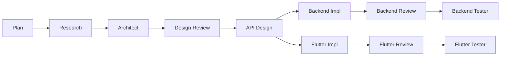

# Agentic SDLC for Claude Code

Minimal, deterministic feature development workflow. Every feature is a self-contained unit under `.agents/<feature>/`.
Agents resolve repo locations/descriptions **only** from `.agents/config.json`.

> [!CAUTION]
> Experimental. Agents can consume large contexts (50k–100k tokens per agent).



## Install

Copy **once** into any workspace (skips if targets already exist; never overwrites):

**macOS / Linux**

```bash
./agents/install.sh
```

**Windows / WSL (PowerShell)**

```powershell
pwsh -File .\agents\install.ps1
```

What it does:

* Copies this repo’s **`.agents/` → `<workspace>/.agents/`**
* Copies this repo’s **`agents/` → `<workspace>/.claude/agents/`**

### Manual install (alternative)

Copy `.agents/` to your workspace root, and `agents/` to `<workspace>/.claude/agents/`.

## Configure repos (`.agents/config.json`)

Agents read repo roots/descriptions here; each `repos[].key` **must match** folders under `.agents/<feature>/changes/<key>/`.

```json
{
  "repos": [
    {
      "key": "backend",
      "path": "../backend",
      "type": "backend",
      "description": "Firebase Functions, Firestore Rules, indexes, emulators."
    },
    {
      "key": "frontend",
      "path": "../frontend",
      "type": "app",
      "description": "Flutter app: screens, routing (GoRouter), blocs, repos, tests."
    }
  ]
}
```

> [!TIP]
> Bootstrap your workflow with **`plan: <feature> [links]`**.

## Feature layout

```
.agents/<feature>/
  brief.md               # user provided brief
  plan.md                # created by the planner agent
  ui/                    # Figma links/exports (optional)
  research/              # researcher
  arch/                  # architect
  api/                  # api-designer (OpenAPI/SDL/JSON Schemas/fixtures)
  backend/               # backend-engineer plan/runbook
  flutter/               # flutter-engineer plan/runbook
  qa/
    backend/             # backend-qa plans/reports
    flutter/             # flutter-qa plans/reports/goldens
  reviews/               # backend-review.md, flutter-review.md, required-deltas.md
```

## Agents (manual only)

* `plan` → creates feature (`plan.md`, folders)
* `researcher` → `research/`
* `architect` → `arch/`
* `api-designer` → `apis/`
* `backend-engineer` → `backend/`
* `backend-reviewer` → `reviews/`
* `backend-tester` → `qa/backend/`
* `flutter-engineer` → `flutter/`
* `flutter-reviewer` → `reviews/`
* `flutter-tester` → `qa/flutter/`

## Rules

* Agents **must only** read repo roots from `.agents/config.json`; no hardcoded paths.
* Install scripts **do not overwrite** existing folders; they skip if the destination exists.
* Keep `changes/<key>/` folder names aligned with `repos[].key`.
* Engineering/QA agents stage files exactly as they should appear in the real repos
