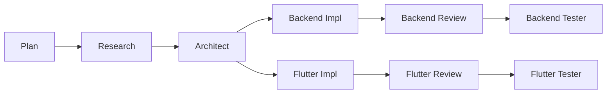

# Agentic SDLC for Claude Code

Minimal, deterministic workflow for shipping features with AI agents. Each feature lives in its own folder under `.agents/<feature>/`. Agents read repo locations only from `.agents/config.json`, and write their outputs into the feature (and when appropriate, into your repos).

> [!CAUTION]
> Experimental. Agents can consume large contexts (50k–100k tokens per agent).



## Why this exists

* **Deterministic**: repeatable outputs, stable folder schema, idempotent merges.
* **Portable**: works in any mono/multi-repo; repo roots resolved from a single JSON file.
* **Separation of concerns**: planning, research, architecture, and implementation are distinct, reviewable artifacts.
* **Feature capsules**: everything for a feature (brief, plans, specs, logs) is in one place.
* **Optimized**: template-driven rendering with templates stored outside agent prompts (`.agents/.templates/` and per-feature overrides) to minimize context size and token usage while keeping outputs consistent.

## At a glance

```
.agents/<feature>/
  brief.md                 # you write this
  ui/                      # you can also provide optional Figma exports
  plan.md                  # plan agent writes/merges
  research/                # researcher outputs
  arch/                    # architect outputs
  backend/                 # backend-engineer plan/runbook (code goes into repo)
  flutter/                 # flutter-engineer plan/runbook (code goes into repo)
  qa/backend/              # backend testing artifacts
  qa/flutter/              # flutter testing artifacts
  reviews/backend          # backend review notes & required deltas
  reviews/flutter          # flutter review notes & required deltas
  logs/                    # change logs from impl agents
```

## Template-driven outputs

Agents render their files from templates under `.agents/.templates/`. Each artifact has a corresponding template for flexibility.

## Install

Copy **once** into any workspace (skips if targets already exist; never overwrites):

**macOS / Linux**

```bash
./agents/install.sh
```

**Windows / WSL (PowerShell)**

```powershell
pwsh -File .\agents\install.ps1
```

What it does:

* Copies this repo’s **`.agents/` → `<workspace>/.agents/`**
* Copies this repo’s **`agents/` → `<workspace>/.claude/agents/`**

> [!NOTE]
> Alternative: copy `.agents/` to your workspace root, and `agents/` to `<workspace>/.claude/agents/`.

## Configure repos (`.agents/config.json`)

```json
{
  "repos": [
    {
      "key": "backend",
      "path": "../backend",
      "type": "backend",
      "description": "Firebase Functions, Firestore Rules, indexes, emulators."
    },
    {
      "key": "frontend",
      "path": "../frontend",
      "type": "app",
      "description": "Flutter app: screens, routing (GoRouter), blocs, repos, tests."
    }
  ]
}
```

* **Flexible**: add any repo types (`backend`, `app`, `design-system`, `marketing`, …).
* **Single source of truth** for paths; agents won’t hardcode directories.

## Quick start

> [!IMPORTANT]
> Agents do **not** auto-invoke each other. You run each step explicitly.

1. **Write a brief**

```bash
mkdir -p .agents/onboarding
$EDITOR .agents/onboarding/brief.md
```

Example `brief.md`:

```md
# Onboarding — Brief
Goal: Create paid organizations. Owner selects seats and pays (Stripe web / IAP mobile).
Non-goals: Trials, advanced seat mgmt, cancellation flows.
Primary flow: Auth → Create Org → Select Plan & Seats → Pay → Verify → Provision → Invite → Done.
...
```

2. **Plan**

```text
planner: onboarding
```

Produces `.agents/onboarding/plan.md`.

3. **Research**

```text
researcher: onboarding
```

Produces `research/current-state.md`, `research/options.md`, `research/recommendation.md`.

4. **Architect**

```text
architect: onboarding
```

Produces `arch/*` (architecture, structure tree, security/tenancy, telemetry/testing, implementation checklist).

5. **Implementation**

Coding agents read `.agents/config.json`, then write **directly into your repos** and log changes under `.agents/<feature>/logs/`.

  ```text
  backend-engineer: onboarding
  flutter-engineer: onboarding
  ```

Produces `backend/*`, `flutter/*`, `logs/*` (plan, runbook, implementation notes)

6. **Code Review**

Review agents annotate findings and required changes. They may safe-apply deltas to repos.

```text
backend-reviewer: onboarding
flutter-reviewer: onboarding
```

Produces `reviews/*` (findings, review notes, required deltas)

7. **Code Testing**

Test agents write plans and tests from a product/design perspective; where applicable they add tests to repos.

```text
backend-tester: onboarding
flutter-tester: onboarding
```

Produces `qa/*` (test plan, defects, results)

## FAQ

**Q: Does this require a specific stack?**

A: No, but defaults target Firebase (Functions + Firestore), Flutter (BloC), and optional GraphQL. You can adapt the agents or add new ones.

**Q: Can I use only some agents?**

A: Yes. They’re independent. Run only the stages you want; others remain empty.

**Q: Why not run all agents automatically?**

A: The entire workflow requires hours to complete, there must be a human in the loop to validate each step and avoid burning tokens on wrong interpretations.

**Q: How do agents find repos?**

A: `.agents/config.json` is the **only** source. Update it once; all agents follow.

## Tips

* Keep `brief.md` short and sharp. Everything else derives from it.
* Use features as **slugs**: `.agents/onboarding`, `.agents/people-directory`, etc.
* Re-run agents after edits; merges are idempotent and won’t clobber your manual notes.
* For code-writing agents, start in a throwaway branch the first time and review the change logs under `.agents/<feature>/logs/`.
