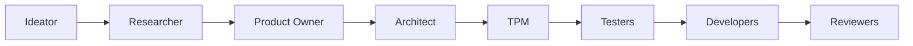

# Agentic SDLC

**AI-powered Software Development Lifecycle automation for Claude Code**

Transform ideas into production-ready code through a structured, agent-driven workflow. Each feature lives in its own isolated workspace under `.agents/<feature>/`, with AI agents handling everything from research and architecture to implementation and testing.

> [!CAUTION]
> **Experimental**: This system is in active development. Agents can consume significant context (50k–100k tokens per agent).

## Workflow Overview

The Agentic SDLC follows a structured pipeline from raw ideas to production-ready code:



### Pipeline Stages

1. **Ideation** → `ideator` transforms scattered ideas in `idea.md` (+ optional UI exports) into a structured `brief.md`
2. **Research** → `researcher` analyzes current state, evaluates options, and recommends technical approach
3. **Product Requirements** → `product-owner` creates user stories, acceptance criteria, and defines scope
4. **Architecture** → `architect` designs system architecture, data flows, security, and telemetry
5. **Planning** → `tpm` (Technical Program Manager) creates implementation plan with task breakdown
6. **Test Specifications** → `ui-tester`, `flutter-tester`, `backend-tester` define test specs (TDD)
7. **Implementation** → `ui-developer`, `flutter-developer`, `backend-developer` write code to repositories
8. **Code Review** → `ui-reviewer`, `flutter-reviewer`, `backend-reviewer` review code and identify issues

## Why Agentic SDLC?

* **🎯 End-to-end automation**: From initial idea to tested, production-ready code
* **🔄 Deterministic & Repeatable**: Stable folder structure, consistent outputs, idempotent operations
* **📦 Feature Isolation**: Everything for a feature lives in `.agents/<feature>/` - briefs, plans, specs, tests, and logs
* **🔌 Stack Agnostic**: Works with any mono/multi-repo setup via `.agents/config.json`
* **👥 Separation of Concerns**: Distinct agents for research, architecture, development, testing, and review
* **⚡ Optimized for Scale**: Template-driven rendering minimizes context and token usage
* **🧪 Test-Driven**: TDD approach with dedicated testing agents per domain
* **🔍 Quality Built-in**: Automated code review before completion

## Feature Structure

Each feature is self-contained in `.agents/<feature>/` with outputs matching the pipeline:

```
.agents/<feature>/
  idea.md                     # Your raw, scattered ideas (input)
  ui/                         # Optional: Figma exports, mockups, screenshots

  brief.md                    # Generated by ideator

  research/
    current-state.md          # Researcher output: existing implementation
    constraints.md            # Researcher output: technical constraints
    web-sources.md            # Researcher output: relevant documentation/articles
    risks.md                  # Researcher output: identified risks

  product-requirements.md     # Product Owner output

  arch/
    architecture.md           # Architect output: system design
    flows.md                  # Architect output: data/control flows
    security.md               # Architect output: security model
    telemetry.md              # Architect output: logging/monitoring

  implementation-plan.md      # TPM output: task breakdown
  test-plan.md                # TPM output: testing strategy

  tdd/
    design-system.md          # UI Tester output
    flutter-app.md            # Flutter Tester output
    backend.md                # Backend Tester output

  implementation/
    design-system.md          # UI Developer output (code → repo)
    flutter-app.md            # Flutter Developer output (code → repo)
    backend.md                # Backend Developer output (code → repo)

  code-findings/
    design-system.md          # UI Reviewer output
    flutter-app.md            # Flutter Reviewer output
    backend.md                # Backend Reviewer output
```

## Available Agents

The system includes specialized agents for each stage of the SDLC:

### Planning & Discovery
- **`ideator`** - Transforms raw ideas into structured feature briefs
- **`researcher`** - Analyzes current state, identifies constraints, and evaluates technical options
- **`product-owner`** - Creates detailed product requirements with user stories and acceptance criteria

### Architecture & Design
- **`architect`** - Designs system architecture, data flows, security, and telemetry
- **`tpm`** (Technical Program Manager) - Creates implementation plans and test specifications

### Testing (TDD)
- **`ui-tester`** - Defines test specifications for design system components
- **`flutter-tester`** - Defines test specifications for Flutter application
- **`backend-tester`** - Defines test specifications for backend services

### Implementation
- **`ui-developer`** - Implements design system components
- **`flutter-developer`** - Implements Flutter application features
- **`backend-developer`** - Implements backend services and APIs

### Quality Assurance
- **`ui-reviewer`** - Reviews design system code for quality and standards
- **`flutter-reviewer`** - Reviews Flutter code for quality and standards
- **`backend-reviewer`** - Reviews backend code for quality and standards

> [!NOTE]
> Agents are **independent** and don't auto-invoke each other. You control the workflow by running agents explicitly.

## Installation

### Quick Install

Clone the repository and run the installation script from the root of your workspace:

**macOS / Linux**
```bash
./agents/install.sh
```

**Windows / PowerShell**
```powershell
pwsh -File .\agents\install.ps1
```

The installer performs these operations:
1. Copies **`.agents/`** → **`<workspace>/.agents/`** (config, templates, features)
2. Copies **`agents/`** → **`<workspace>/.claude/agents/`** (agent definitions)

> [!NOTE]
> Installation is **idempotent** - it skips existing destinations and never overwrites files.

### Manual Installation

Alternatively, manually copy the directories:
```bash
cp -r .agents /path/to/your/workspace/
cp -r agents /path/to/your/workspace/.claude/
```

## Configuration

### Repository Setup (`.agents/config.json`)

Define your project repositories in `.agents/config.json`. This is the **single source of truth** for repository paths - agents will never hardcode paths.

```json
{
  "repos": [
    {
      "key": "backend",
      "path": "../backend",
      "type": "backend",
      "description": "Firebase Functions, Firestore Rules, indexes, emulators"
    },
    {
      "key": "frontend",
      "path": "../frontend",
      "type": "app",
      "description": "Flutter app: screens, routing (GoRouter), blocs, repos, tests"
    },
    {
      "key": "design-system",
      "path": "../design-system",
      "type": "ui",
      "description": "Shared UI components and design tokens"
    }
  ]
}
```

**Configuration Properties:**
- `key` - Unique identifier for the repository
- `path` - Relative or absolute path to the repository
- `type` - Repository type (`backend`, `app`, `ui`, `docs`, etc.)
- `description` - Brief description for agents to understand the repo's purpose

> [!TIP]
> You can add any number of repositories with custom types. The system is flexible and stack-agnostic.

## Quick Start Guide

> [!IMPORTANT]
> Agents are **independent** and must be invoked explicitly. They do not auto-chain or call each other.

### Complete Workflow Example

Let's build a feature called "user-authentication":

#### 1. Provide Your Idea

Create an `idea.md` file with your scattered thoughts and optionally include UI exports:

```bash
mkdir -p .agents/user-authentication
```

Create `.agents/user-authentication/idea.md`:
```markdown
need user login feature
- email and password
- maybe google oauth?
- users should be able to reset password
- need to keep them logged in with tokens

also github login would be nice
```

Optionally add UI exports:
```
.agents/user-authentication/ui/
  login-screen.png
  signup-screen.png
```

Then run the ideator agent from the claude CLI:
```text
@agents ideator: user-authentication
```

The ideator will transform your raw ideas into a structured `brief.md` with clear goals, scope, and requirements.

#### 2. Research Phase

```text
@agents researcher: user-authentication
```

**Outputs:**
- `research/current-state.md` - Existing auth implementation analysis
- `research/constraints.md` - Technical and business constraints
- `research/web-sources.md` - Relevant documentation and articles
- `research/risks.md` - Identified risks and mitigations

#### 3. Product Requirements

```text
@agents product-owner: user-authentication
```

**Outputs:**
- `product-requirements.md` - User stories, acceptance criteria, scope

#### 4. Architecture Design

```text
@agents architect: user-authentication
```

**Outputs:**
- `arch/architecture.md` - System design and data models
- `arch/flows.md` - Data flows and control flows
- `arch/security.md` - Security model and token management
- `arch/telemetry.md` - Logging, monitoring, and observability

#### 5. Technical Planning

```text
@agents tpm: user-authentication
```

**Outputs:**
- `implementation-plan.md` - Detailed task breakdown
- `test-plan.md` - Testing strategy and approach

#### 6. Test-Driven Development

Define test specifications before implementation:

```text
@agents ui-tester: user-authentication
@agents flutter-tester: user-authentication
@agents backend-tester: user-authentication
```

**Outputs:**
- `tdd/design-system.md` - Design system TDD specs
- `tdd/flutter-app.md` - Flutter app TDD specs
- `tdd/backend.md` - Backend TDD specs

#### 7. Implementation

Implement the feature across all layers (code written to repos):

```text
@agents ui-developer: user-authentication
@agents flutter-developer: user-authentication
@agents backend-developer: user-authentication
```

**Outputs:**
- Code changes written directly to configured repositories
- `implementation/design-system.md` - UI implementation notes
- `implementation/flutter-app.md` - Flutter implementation notes
- `implementation/backend.md` - Backend implementation notes

#### 8. Code Review

Review implemented code for quality and standards:

```text
@agents ui-reviewer: user-authentication
@agents flutter-reviewer: user-authentication
@agents backend-reviewer: user-authentication
```

**Outputs:**
- `code-findings/design-system.md` - UI code review findings
- `code-findings/flutter-app.md` - Flutter code review findings
- `code-findings/backend.md` - Backend code review findings

## FAQ

### General Questions

**Q: What technology stacks does this support?**

A: Agentic SDLC is **stack-agnostic**. While the default configuration targets Firebase (Functions + Firestore) and Flutter (with BloC pattern), you can adapt agents for any stack: React, Vue, Node.js, Python, Go, etc. Simply update the agent prompts and repository configuration.

**Q: Can I run only some agents and skip others?**

A: Yes! Agents are completely independent. Run only the stages you need - skipped stages simply remain empty. For example, you might skip the ideator if you already have a brief, or skip UI development for a backend-only feature.

**Q: Why don't agents automatically chain together?**

A: The full pipeline can take **hours** and consume **300k+ tokens**. Human validation at each stage prevents compounding errors and wasted tokens on incorrect assumptions. You maintain full control over when to proceed.

**Q: How do agents locate my repositories?**

A: `.agents/config.json` is the **single source of truth**. Agents read this file to discover repository paths - no hardcoded paths exist anywhere. Update the config once, and all agents follow.

**Q: Can I modify agent outputs?**

A: Absolutely! All agent outputs are markdown files you can edit freely.

**Q: How do I customize agent behavior?**

A: Edit the agent definitions in `.claude/agents/` to modify prompts, add custom instructions, or change output formats. You can also override templates in `.agents/.templates/`.

**Q: What happens if an agent makes a mistake?**

A: All code changes are written to your repositories like any other edit. Use version control (git) to review and revert unwanted changes. Implementation notes in `.agents/<feature>/implementation/` help track what changed.

**Q: Can I use this in production?**

A: This is **experimental** software. Use it in non-critical projects first, always review agent outputs, and maintain proper version control. Never commit agent changes without review.

### Technical Questions

**Q: How much does this cost in API tokens?**

A: A complete pipeline for a medium feature consumes approximately **200k-400k tokens** across all agents. Complex features can exceed 500k tokens. Use Claude's Sonnet model for the best cost/performance ratio.

**Q: Can I run agents in parallel?**

A: Some stages support parallelization:
- ✅ **Can run in parallel**: All three testers (ui/flutter/backend), all three developers, all three reviewers
- ❌ **Must run sequentially**: ideator → researcher → product-owner → architect → tpm

**Q: How do I handle merge conflicts from agent changes?**

A: Treat agent commits like any other developer's work. Review the diffs, resolve conflicts manually, and commit the merged result. The `.agents/<feature>/implementation/` notes help understand intent.

## Best Practices

### For Optimal Results

✅ **DO:**
- Start with raw ideas in `idea.md` - let the ideator structure them
- Use descriptive feature names as slugs (e.g., `user-auth`, `payment-flow`)
- Include UI exports (Figma, screenshots) when available
- Review each stage output before proceeding to the next
- Run code-writing agents in a feature branch first
- Keep your `.agents/config.json` up to date
- Commit agent outputs to version control for tracking
- Re-run agents after manual edits - merges overwrite previous state

❌ **DON'T:**
- Skip the ideator - don't manually write `brief.md`
- Write overly detailed ideas - bullet points and sketches are enough
- Skip the research and architecture stages for complex features
- Auto-commit agent code changes without review
- Hardcode repository paths anywhere
- Run the full pipeline without intermediate reviews
- Ignore code review findings from reviewer agents

### Workflow Tips

**Iterative Development**
- Start with `ideator` to transform your raw ideas into a structured brief
- Run researcher → product-owner → architect → tpm in sequence
- Review the plan, adjust if needed, then proceed to testers
- Implement one domain at a time (backend → flutter → ui)
- Review and test each domain before moving to the next

**Token Optimization**
- Keep `idea.md` raw and brief - bullet points are enough
- The ideator will structure it properly for downstream agents
- Use template overrides to customize outputs without changing prompts
- Skip stages that don't apply (e.g., ui-developer for backend-only features)

**Quality Assurance**
- Always run testers *before* developers to define specifications
- Run reviewers after developers to catch issues early

## Contributing

Contributions are welcome! This is an experimental project exploring AI-driven SDLC automation.

### How to Contribute

- **Report bugs** - Open an issue with reproduction steps
- **Suggest agents** - Propose new agent types for different stages or stacks
- **Improve prompts** - Submit PRs to enhance agent prompts in `.claude/agents/`
- **Add templates** - Create new output templates in `.agents/.templates/`
- **Share examples** - Document your workflows and share successful feature builds

## License

MIT License - See LICENSE file for details

## Acknowledgments

Built for [Claude Code](https://claude.ai/code) by Anthropic. This project demonstrates agentic workflows for software development lifecycle automation.
